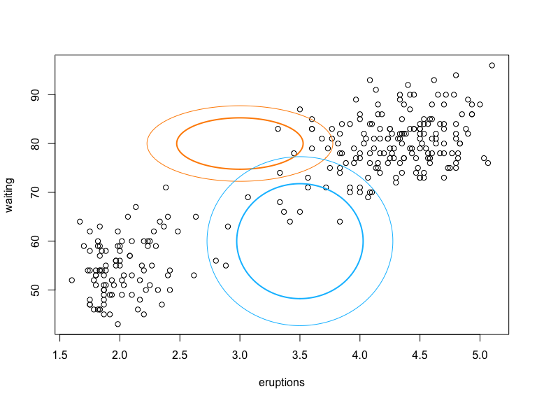
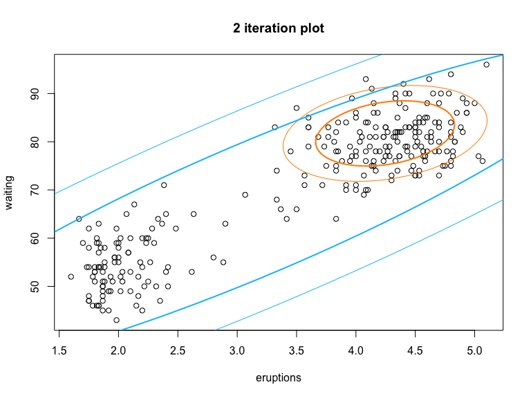
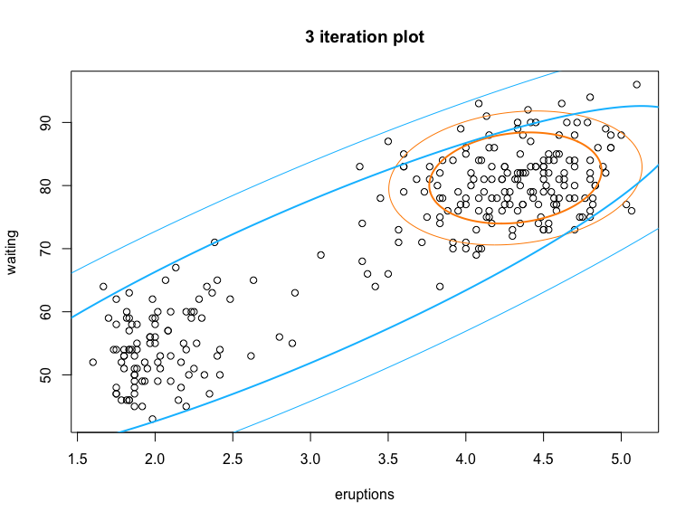
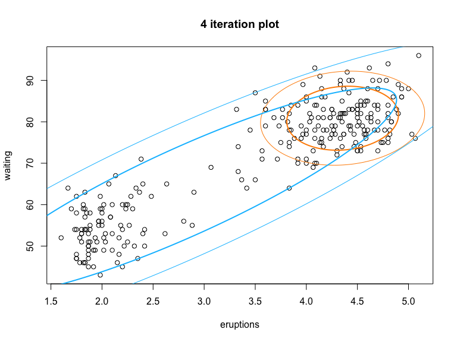
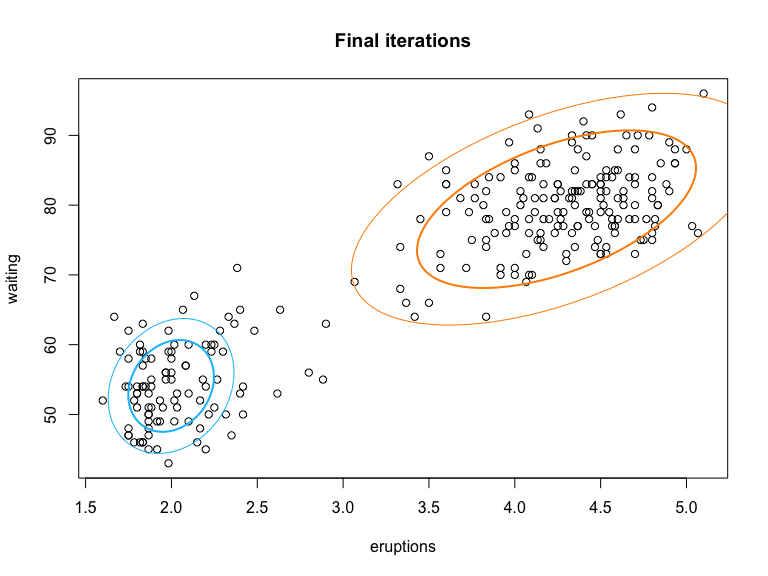
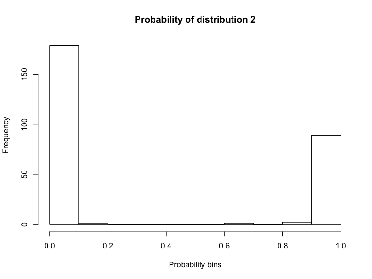
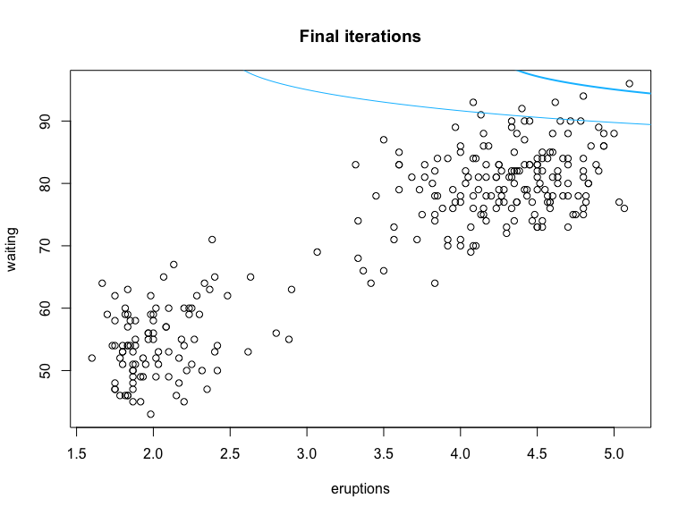
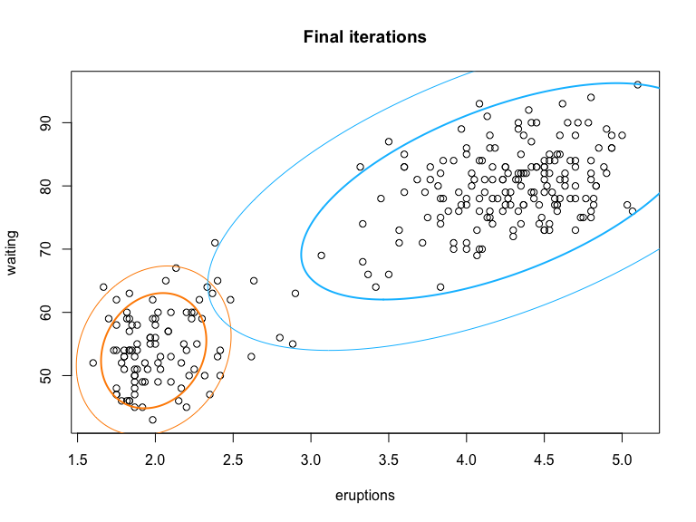

Expectation Maximization Model
================
Rishabh Vaish

## Two-dimensional Gaussian Mixture Model

We consider an example of the EM algorithm, which fits a Gaussian
mixture model to the Old Faithful eruption data. For a demonstration of
this problem, see the figure provided on
[Wikipedia](https://en.wikipedia.org/wiki/Expectation%E2%80%93maximization_algorithm).
As the end result, we will obtain the distribution parameters of the two
underlying distributions. We consider the problem as follows. For this
question, you are allowed to use packages that calculate the densities
of normal distributions.

``` r
# load the data
faithful = read.table("faithful.txt")

# the parameters
mu1 = c(3, 80)
mu2 = c(3.5, 60)
Sigma1 = matrix(c(0.1, 0, 0, 10), 2, 2)
Sigma2 = matrix(c(0.1, 0, 0, 50), 2, 2)

# plot the current fit
library(mixtools)
plot(faithful)

addellipse <- function(mu, Sigma, ...)
{
  ellipse(mu, Sigma, alpha = .05, lwd = 1, ...)
  ellipse(mu, Sigma, alpha = .25, lwd = 2, ...)
}

addellipse(mu1, Sigma1, col = "darkorange")
addellipse(mu2, Sigma2, col = "deepskyblue")
```



  - We use both variables `eruptions` and `waiting`. We assume that the
    underlying distributions given the unobserved latent variables are
    both two-dimensional normal: \(N(\mu_1, \Sigma_1)\) and
    \(N(\mu_2, \Sigma_2)\), respectively, while \(\mu_1\), \(\Sigma_1\),
    \(\mu_2\), and \(\Sigma_2\) are unknow parameters that we need to
    solve.

  - We assume that the unobserved latent variables (that indicate the
    membership) follow i.i.d. Bernoulli distribution, with parameter
    \(p\).

  - Based on the logic of an EM algorithm, we will first initiate some
    values of the parameters in the normal distribution. I provided a
    choice of them, and the normal density plots based on the initial
    values.

  - Your goal is to write the EM algorithm that progressively updates
    the parameters and the latent variable distribution parameter.
    Eventually, we will reach a stable model fitting result that
    approximate the two underlying distributions, as demonstrated on the
    Wikipedia page. Choose a reasonable stopping criterion. To
    demonstrate your results, you should provide at least the following
    information.

<!-- end list -->

``` r
start_time = Sys.time()
# the parameters
mu1 = c(3, 80)
mu2 = c(3.5, 60)
Sigma1 = matrix(c(0.1, 0, 0, 10), 2, 2)
Sigma2 = matrix(c(0.1, 0, 0, 50), 2, 2)
p = 0.5
x <- as.matrix(faithful)

threshold = 100
iter = 0
# stopping criterion is on Pi. If it is same for two iterations, then we stop
while (threshold > 10 ^ -3) {
  iter = iter + 1
  # E step
  # calculate the conditional distribution of the hidden variable z
  d1 = p * dmvnorm(x, mu = mu1, sigma = Sigma1)
  d2 = (1 - p) * dmvnorm(x, mu = mu2, sigma = Sigma2)
  ez = as.matrix(d2 / (d1 + d2))
  ez = t(ez)
  
  # M-step
  # based on the conditional distribution, calculate the new MLE of the parameters
  p_old = p
  p = sum(1 - ez) / nrow(x)
  threshold = abs(p - p_old)
  mu1 =  ((1 - ez) %*% x) / sum(1 - ez)
  mu2 = (ez %*% x) / sum(ez)
  sigma1_prob = sweep(sweep(x, 2, mu1), 1, 1 - ez, "*")
  Sigma1 = (t(sweep(x, 2, mu1)) %*% sigma1_prob) / sum(1 - ez)
  sigma2_prob = sweep(sweep(x, 2, mu2), 1, ez, "*")
  Sigma2 = (t(sweep(x, 2, mu2)) %*% sigma2_prob) / sum(1 - ez)
  
  #plotting the normal densities at the 2nd, 3rd, 4th 
  if (iter == 2 || iter == 3 || iter == 4){
    # plot the current fit
    library(mixtools)
    plot(faithful, main = paste(iter , "iteration plot"), xlab = "eruptions", ylab = "waiting")
    
    addellipse(as.vector(mu1), Sigma1, col = "darkorange")
    addellipse(as.vector(mu2), Sigma2, col = "deepskyblue")
  }
}
```



``` r
# iterations for converges
iter
```

    ## [1] 19

``` r
end_time = Sys.time()
#time taken
end_time - start_time
```

    ## Time difference of 0.2125099 secs

``` r
# plot the final fit
library(mixtools)
plot(faithful, main = "Final iterations", xlab = "eruptions", ylab = "waiting")

addellipse(as.vector(mu1), Sigma1, col = "darkorange")
addellipse(as.vector(mu2), Sigma2, col = "deepskyblue")
```


+ The distribution parameters \(p\), \(\mu_1\), \(\Sigma_1\), \(\mu_2\),
and \(\Sigma_2\)

``` r
# Pi - probability of second distribution
p
```

    ## [1] 0.6635804

``` r
# Parameters of first normal distribution
mu1
```

    ##      eruptions  waiting
    ## [1,]  4.243027 79.41968

``` r
Sigma1
```

    ##           eruptions   waiting
    ## eruptions 0.2380837  1.736567
    ## waiting   1.7365672 46.005117

``` r
# Parameters of second normal distribution
mu2
```

    ##      eruptions  waiting
    ## [1,]  1.998081 54.08637

``` r
Sigma2
```

    ##            eruptions    waiting
    ## eruptions 0.02239748  0.1173839
    ## waiting   0.11738388 15.5889378

  - A histogram of the underlying probabilities of the latent
variables

<!-- end list -->

``` r
hist(ez, main = "Probability of distribution 2", xlab = "Probability bins")
```



  - Now, experiment a very different initial value of the parameters and
    rerun the algorithm. Comment on the efficiency and convergence speed
    of this algorithm.

<!-- end list -->

``` r
start_time = Sys.time()

# the parameters
mu1 = c(1, 10)
mu2 = c(8, 100)
Sigma1 = matrix(c(1, 0, 0, 10), 2, 2)
Sigma2 = matrix(c(5, 0, 0, 25), 2, 2)
p = 0.5
x <- as.matrix(faithful)

#plot showing the random intialisation
plot(faithful, main = "Final iterations", xlab = "eruptions", ylab = "waiting")
addellipse(mu1, Sigma1, col = "darkorange")
addellipse(mu2, Sigma2, col = "deepskyblue")
```



``` r
threshold = 100
iter = 0
# stopping criterion is on Pi. If it is same for two iterations, then we stop
while (threshold > 10 ^ -3) {
  iter = iter + 1
  # E step
  # calculate the conditional distribution of the hidden variable z
  d1 = p * dmvnorm(x, mu = mu1, sigma = Sigma1)
  d2 = (1 - p) * dmvnorm(x, mu = mu2, sigma = Sigma2)
  ez = as.matrix(d2 / (d1 + d2))
  ez = t(ez)
  
  # M-step
  # based on the conditional distribution, calculate the new MLE of the parameters
  p_old = p
  p = sum(1 - ez) / nrow(x)
  threshold = abs(p - p_old)
  mu1 =  ((1 - ez) %*% x) / sum(1 - ez)
  mu2 = (ez %*% x) / sum(ez)
  sigma1_prob = sweep(sweep(x, 2, mu1), 1, 1 - ez, "*")
  Sigma1 = (t(sweep(x, 2, mu1)) %*% sigma1_prob) / sum(1 - ez)
  sigma2_prob = sweep(sweep(x, 2, mu2), 1, ez, "*")
  Sigma2 = (t(sweep(x, 2, mu2)) %*% sigma2_prob) / sum(1 - ez)
}
# iterations for converges
iter
```

    ## [1] 48

``` r
end_time = Sys.time()
#time taken
end_time - start_time
```

    ## Time difference of 0.06576586 secs

``` r
# Pi - probability of second distribution
p
```

    ## [1] 0.3271164

``` r
# Parameters of first normal distribution
mu1
```

    ##      eruptions  waiting
    ## [1,]  1.989386 53.93956

``` r
Sigma1
```

    ##            eruptions    waiting
    ## eruptions 0.04128805  0.1955951
    ## waiting   0.19559511 29.9583046

``` r
# Parameters of second normal distribution
mu2
```

    ##      eruptions waiting
    ## [1,]  4.216216 79.1408

``` r
Sigma2
```

    ##           eruptions    waiting
    ## eruptions 0.5898552   4.616221
    ## waiting   4.6162207 105.622342

``` r
#final plot
plot(faithful, main = "Final iterations", xlab = "eruptions", ylab = "waiting")
addellipse(as.vector(mu1), Sigma1, col = "darkorange")
addellipse(as.vector(mu2), Sigma2, col = "deepskyblue")
```



Starting with a very different initial values takes longer to converge
(48 iterations to 19 interations) as expected, because the
initialisation is very random. The convergence rate is fast.

Now comparing the time taken for algorithm to run for comparing
efficiency - Initial values that were given - 0.08863306 secs (without
graph plots) Very different initial values - 0.09386897 secs Although
the number of iterations increased, the algorithm is still very fast and
efficient.

Another observation is that for some intializations the probability of
one of the distribution becomes 1 or 0. I think this happens one of the
distribution is initialised very far off hence the other distribution is
able to explain all the datapoints.

Overall if the initialisations are not very far off then algorithm is
fast to converge and efficient.
