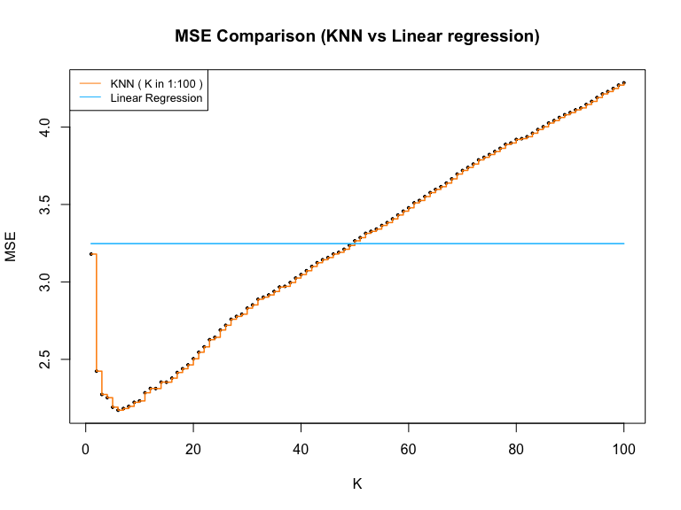

KNN
================
Rishabh Vaish
11/10/2019

## KNN

Function myknn(xtest, xtrain, ytrain, k) that fits a KNN model that
predict a target point or multiple target points xtest. Here xtrain is
the training dataset covariate value, ytrain is the training data
outcome, and k is the number of nearest neighbors. Use the \(l2\) norm
to evaluate the distance between two points. Please note that you cannot
use any additional R package within this function.

### Function

``` r
myknn <- function(xtest, xtrain, ytrain, k)
{
  #Assuming Matrix inputs, checking dimensions
  xtest_dim<- dim(xtest)
  xtrain_dim <- dim(xtrain)
  ytrain_dim <- dim(ytrain)
  
  #Create the Ypred output matrix
  ypred <- matrix(data=NA,nrow=xtest_dim[1],ncol= 1)
  
  # Main function to calculate distances and get the top k ytrain
  for ( xtest_row in 1:xtest_dim[1] ){
    #Create the test row vector
    xtest_vector = xtest[xtest_row,]
    
    # To find distance step 1 - subtract xtest_vector from xtrain
    d1 <- sweep(xtrain,2,xtest_vector)
    # To find distance step 2 - sum the squares of rows and take square root
    d2 <- matrix(sqrt(rowSums( d1^2)), xtrain_dim[1],1)
    
    #Combine Ytrain with Distance matrix
    dist_ytrain <- cbind(d2, ytrain)
    colnames(dist_ytrain) <- c('Distance','Ytrain')
    
    #Order by distance
    ordered_dist_ytrain <- dist_ytrain[order(dist_ytrain[,'Distance']),]
    
    # Set Ypred = Average of top K values of ordered_dist_ytrain
    ypred[xtest_row,] <- mean(ordered_dist_ytrain[1:k,'Ytrain'])
  }
  
  return(ypred)
}
```

### Data Generation

Generating 1000 observations from a five-dimensional normally
distribution: \[N (\mu, \Sigma_{5x5})\] where
\(\mu = (1, 2, 3, 4, 5)^T\) and \(\Sigma_{5x5}\) is an autoregressive
covariance matrix, with the \((i, j)^{th}\) entry equal to
\(0.5^ {\mid i-j \mid }\). Then, generate outcome values Y based on the
linear model \[ Y = X_1 + X_2 + (X_3 - 2.5)^2 + \epsilon\] where
\(\epsilon\) follows i.i.d. standard normal distribution.

Using the nvrnorm function in MASS library to generate five-dimensional
normally distributed X. I have used rnorm function to set \(\epsilon\)
in true function.

``` r
library(MASS)
#Set mean
mu <- c(1, 2, 3, 4, 5)
#Create variance matrix 
sigma <- matrix(0,5,5)
for (i in 1:5){
  for (j in 1:5){
    sigma[i,j] = 0.5 ^ (abs(i-j))
  }
}

#Set seed and generate data
set.seed(1)
x <- mvrnorm(n = 1000, mu, sigma)
y <- matrix(x[,1] + x[,2] + (x[,3] - 2.5)^2 + rnorm(length(x)), nrow(x), 1 )

#Combine data and set variable names
data <- cbind(x,y)
colnames(data) <- c( "x1", "x2", "x3", "x4", "x5", "y")
head(data,3)
```

    ##              x1       x2       x3       x4       x5        y
    ## [1,]  2.0770490 3.555163 2.641969 3.902436 5.108741 4.135994
    ## [2,]  2.4780195 2.161175 2.188487 2.796376 5.330744 5.365376
    ## [3,] -0.1413538 2.630428 4.666608 4.493909 5.698190 5.505069

### Predictions

Using the first 400 observations of your data as the training data and
the rest as testing data. Predict the Y values using your KNN function
with k = 5. Evaluate the prediction accuracy using mean squared error
\[\frac{1}{N}\sum_{i}\left ( y_i - \hat{y}_i\right )^2\]

Using first 400 rows as training data and testing on the next 600 rows
yields an MSE = 2.19

``` r
#setting training and testing data
xtrain <- x[1:400,]
xtest <- x[401:1000,]
ytrain <- y[1:400]
ytest <- y[401:1000]
#Using K = 5
k = 5

#Using the function 
ypred <- myknn(xtest, xtrain, ytrain, 5)

#Computing error
knn_error <- colSums((ytest - ypred)^2)/length(ytest)
#MSE with K=5
knn_error
```

    ## [1] 2.191387

### Comparison with linear model

Compare the prediction error of a linear model with your KNN model.
Consider k being 1, 2, 3, . . ., 9, 10, 15, 20, . . ., 95, 100.

Created a matrix (knn\_errorMatrix) to store MSE while varying K from 1
to 100.

``` r
#Define the max K value
k_range <- 100
# Create an error matrix
knn_errorMatrix = matrix(NA, k_range, 2)
colnames(knn_errorMatrix) <- c("k", "MSE")

#Looping through each K and storing the MSE
for (k in 1:k_range)
{
  ypred <- myknn(xtest, xtrain, ytrain, k)
  knn_errorMatrix[k, 1] <- k
  knn_errorMatrix[k, 2] <- colSums((ytest - ypred)^2)/length(ytest)
}
#Sample of matrix
head(knn_errorMatrix)
```

    ##      k      MSE
    ## [1,] 1 3.179724
    ## [2,] 2 2.423957
    ## [3,] 3 2.273419
    ## [4,] 4 2.252683
    ## [5,] 5 2.191387
    ## [6,] 6 2.171828

I have used the lm function in R to fit a linear model for comparison
with KNN. It yields an MSE = 3.24

``` r
#creating testing and training dataframe for fitting lm model 
train_df <- data.frame(cbind(xtrain,ytrain))
colnames(train_df) <- c('x1','x2','x3','x4','x5', 'ytrain')
test_df <- data.frame(xtest)
colnames(test_df) <- c('x1','x2','x3','x4','x5')

#Fitting the lm model
linear_model = lm(ytrain ~ x1+x2+x3+x4+x5, data = train_df)
#Predicting 
ypred_lm <- matrix(predict(linear_model, data.frame(test_df)), length(ytest), 1)

#Calculating the MSE
error_lm <- colSums((ytest - ypred_lm)^2)/length(ytest)
error_lm
```

    ## [1] 3.247147

Making a figure to show the variation of MSE with K for KNN and
comparing it with the MSE of simple linear regression model (lm)

``` r
#Plotting the figure and adding the legend
plot( 1:k_range, knn_errorMatrix[ , 2], pch = 19, cex = 0.4, xlab = "K", ylab = "MSE")
lines(1:k_range, knn_errorMatrix[ , 2], type = "s", col = "darkorange", lwd = 1.5)
lines(1:k_range, rep(error_lm, k_range), type = "s", col = "deepskyblue", lwd = 1.5)
title(main="MSE Comparison (KNN vs Linear regression)")
legend("topleft", legend=c("KNN ( K in 1:100 )", "Linear Regression"),
       col=c("darkorange", "deepskyblue"), lty=1, cex=0.8)
```


