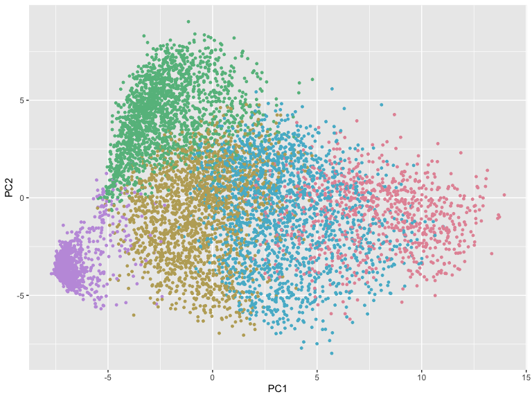

K-means Clustering
================
Rishabh Vaish

## K-Means Clustering

Let’s consider coding a K-means algorithm. Perform the following:

  - Load the `zip.train` (handwritten digit recognition) data from the
    ElemStatLearn package, and the goal is to identify clusters of
    digits based on only the pixels.

<!-- end list -->

``` r
#load data
library(ElemStatLearn)
data("zip.train")
#remove the first column
x <- zip.train[, 2:ncol(zip.train)]
```

  - Writing your own code of k-means that iterates between two steps,
    and stop when the cluster membership does not change.
      - updating the cluster means given the cluster membership
      - updating the cluster membership based on cluster means

<!-- end list -->

``` r
# k means clustering function takes x and k as input and gives
# final clusters for each x_i as output
k_means <- function(x, k) {
  # assigning random clusters initially
  clustered <-
    as.matrix(cbind(x, cluster = floor(runif(
      nrow(x), min = 1, max = 6
    ))))
  
  new_clusters = rep(0, nrow(clustered))
  iter = 0
  
  # while loop to assign and update clusters till
  # clusters dont change or maximum iterations is reached
  while (iter < 100) {
    #calculate cluster means
    cluster_means <-
      as.matrix(aggregate(clustered, list(clustered[, 257]), mean))
    #remove group column
    cluster_means <- cluster_means[,-1]
    # assigning new clusters to each row on the basis of cluster means
    for (i in 1:nrow(clustered)) {
      distances <- sqrt(rowSums(sweep(cluster_means, 2, clustered[i, ]) ^ 2))
      new_clusters[i] <-  which.min(distances)
    }
    #checking if the clusters change, else update clusters
    if (all(new_clusters == clustered[, ncol(clustered)])) {
      break
    } else{
      clustered[, ncol(clustered)] = new_clusters
    }
    #take count of iterations
    iter = iter + 1
  }
  #return new clusters
  return(new_clusters)
}
```

  - Perform your algorithm with one random initialization with \(k = 5\)
      - For this question, compare your cluster membership to the true
        digits. What are the most prevalent digits in each of your
        clusters?

<!-- end list -->

``` r
#one iteration
k = 5
start_time = Sys.time()
clust <- k_means(x, k)
end_time = Sys.time()
#time taken for one iteration
end_time - start_time
```

    ## Time difference of 16.96305 secs

``` r
#most prevalant digits per cluster
results <-
  as.data.frame(cbind(cluster = clust, digit = zip.train[, 1]))
#clusters vs digits analysis
table(results)
```

    ##        digit
    ## cluster    0    1    2    3    4    5    6    7    8    9
    ##       1   23    0  625   30   73   32   66    6  175    4
    ##       2    5    0   18   41  455   33    5  625  136  586
    ##       3  846    0   13    8    7   41   84    0   11    3
    ##       4  318    0   39  575   21  447  469    3  154    6
    ##       5    2 1005   36    4   96    3   40   11   66   45

  - Perform your algorithm with 10 independent initiations with
    \(k = 5\) and record the best
      - For this question, plot your clustering results on a
        two-dimensional plot, where the two axis are the first two
        principle components of your data

<!-- end list -->

``` r
#for 10 independent initiations
clust <- matrix(0, nrow = nrow(x), ncol = 10)
for (i in 1:10) {
  clust[, i] <- k_means(x, k)
}

#calculate between cluster distance for each of the iterations
# to choose best model
between_clust_dist <- rep(0, 10)
for (i in 1:10) {
  #calculate cluster means
  data <- as.matrix(cbind(x, cluster = clust[, i]))
  cluster_mean <- as.matrix(aggregate(data, list(data[, 257]), mean))
  sum = 0
  count = 1
  #calculate average between cluster distance for each iteration
  for (m in 1:k) {
    for (n in m:k) {
      sum = sum + sqrt(sum((cluster_mean[m, 1:256] - cluster_mean[n, 1:256]) ^
                             2))
      count = count + 1
    }
  }
  between_clust_dist[i] <- sum / count
}

which.max(between_clust_dist)
```

    ## [1] 9

``` r
#pca
zip_pc = prcomp(x)

#plot on pca components
library(ggplot2)
library(colorspace)
ggplot(data = data.frame(zip_pc$x), aes(x = PC1, y = PC2)) +  
  geom_point(color = rainbow_hcl(5)[clust[, which.max(between_clust_dist)]], size = 1)
```



  - Compare the clustering results from the above two questions with the
    built-in `kmeans()` function in R. Use tables/figures to demonstrate
    your results and comment on your findings.

<!-- end list -->

``` r
set.seed(1)

# k mean clustering
kmean <- kmeans(zip.train[, 2:ncol(zip.train)], centers = 5, nstart = 10)

#most prevalant didgit per cluster for r kmeans models
result_r <-
  as.data.frame(cbind(cluster = kmean$cluster, digit = zip.train[, 1]))
#clusters vs digits analysis
result_r <- table(result_r)
result_r
```

    ##        digit
    ## cluster    0    1    2    3    4    5    6    7    8    9
    ##       1    0 1003    6    2   59    1   13    7   23   23
    ##       2    1    0   48   21  484   32    3  629  190  609
    ##       3  881    0   22    2    4   36   68    1    5    3
    ##       4   28    1   93  615    4  383    2    1  262    4
    ##       5  284    1  562   18  101  104  578    7   62    5

``` r
#most prevalant didgit per cluster for best of 10 models
result <-
  as.data.frame(cbind(cluster = clust[, which.max(between_clust_dist)], digit = zip.train[, 1]))
#clusters vs digits analysis
table(result)
```

    ##        digit
    ## cluster    0    1    2    3    4    5    6    7    8    9
    ##       1  686    0   24    7    7   26   64    0    6    2
    ##       2   73    4  641   96  135  121  324    8  398    5
    ##       3    0    0   16   38  431   21    0  629   60  597
    ##       4  435    0   47  516   25  388  272    1   64   10
    ##       5    0 1001    3    1   54    0    4    7   14   30

According to R Kmeans following are the digits in each clusters -
*cluster1 - {1} *cluster2 - {4,7,9} *cluster3 - {0} *cluster4 - {3,5,8}
\*cluster5 - {2,6}

According to 10 iteration with my function following are the digits in
each clusters of the best model- *cluster1 - {1} *cluster5 - {4,7,9}
*cluster2 - {0} *cluster3 - {2,3,8} \*cluster4 - {5,6}

According to 1 iteration with my function following are the digits in
each clusters - *cluster2 - {1} *cluster4 - {4,7,9} *cluster3 - {0}
*cluster5 - {3,5,6,8} \*cluster1 - {2}

The best of 10 models using my function works nearly as good as the
kmeans R function. Just 2 and 5 are the digits swapped. The digits
{4,7,9} are similar and are rightly clustered together. {0} and {1} is
not clustered with any other digit, rightly so. In my algo {5,6} are
clustered together whereas {2,6} are clustered together in R Kmeans.
Results are mostly similar with an exception of 2 and 5. The clustering
seems correct and justifiable.
