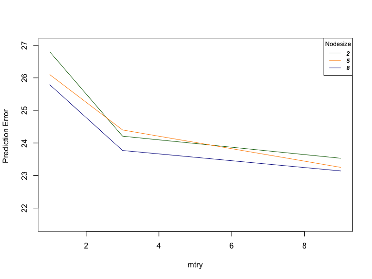
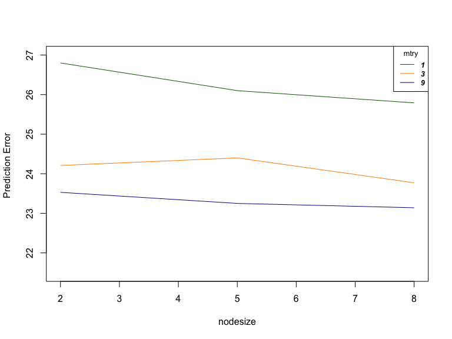
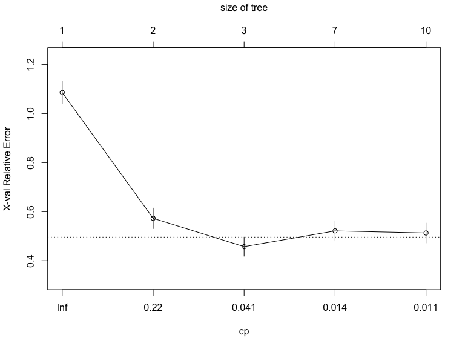
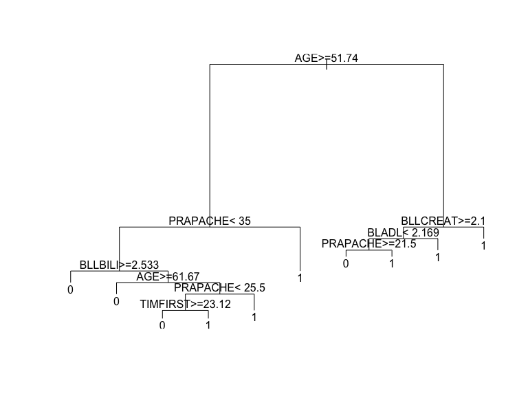

Random Forest
================
Rishabh Vaish

## Tuning Random Forests in Virtual Twins

Personalized medicine draws a lot of attention in medical research. The
goal of personalized medicine is to make a tailored decision for each
patient, such that his/her clinical outcome can be optimized. Let’s
consider data modified from the [SIDES
method](http://biopharmnet.com/subgroup-analysis-software/). In this
dataset, 470 patients and 13 variables are observed. You can download
the data from our website. The variables are listed below.

  - `Health`: health outcome (larger the better)
  - `THERAPY`: 1 for active treatment, 0 for the control treatment
  - `TIMFIRST`: Time from first sepsis-organ fail to start drug
  - `AGE`: Patient age in years
  - `BLLPLAT`: Baseline local platelets
  - `blSOFA`: Sum of baseline sofa score (cardiovascular, hematology,
    hepatorenal, and respiration scores)
  - `BLLCREAT`: Base creatinine
  - `ORGANNUM`: Number of baseline organ failures
  - `PRAPACHE`: Pre-infusion apache-ii score
  - `BLGCS`: Base GLASGOW coma scale score
  - `BLIL6`: Baseline serum IL-6 concentration
  - `BLADL`: Baseline activity of daily living score
  - `BLLBILI`: Baseline local bilirubin
  - `BEST`: The true best treatment suggested by Doctors. **You should
    not use this variable when fitting the model**\!

For each patient, sepsis was observed during their hospital stay. Hence,
they need to choose one of the two treatments (indicated by variable
`THERAPY`) to prevent further adverse events. After the treatment, their
health outcome (`health`) were measured, with a larger value being the
better outcome. However, since treatments were assigned randomly, we are
not able to suggest better treatment for a new patient. A strategy
called [Virtual
Twins](https://onlinelibrary.wiley.com/doi/abs/10.1002/sim.4322) was
proposed by Foster et al. (2011) to tackle this problem. We consider a
simpler version of the method. We fit two random forests to model the
outcome `health`: one model uses all patients who received treatment 1,
and another model for all patients who received treatment 0. Denote
these two models as \(\widehat f_1(x)\) and \(\widehat f_0(x)\),
respectively. When a new patient arrives, we use both models to predict
the outcomes and see which model gives a better health status. We will
suggest the treatment label associated with the model that gives a
larger prediction value. In other words, for a new \(x^\ast\), we
compare \(\widehat f_1(x^\ast)\) and \(\widehat f_0(x^\ast)\) and
suggest the better lable. The goal for this question is to select tuning
parameters for random forest such that it will suggest the best
treatment for a patient. Perform the following:

``` r
# Data import
library(readr)
sepsis <- read_csv("data/Sepsis.csv")

#Removing row ID
sepsis$X1 <- NULL
```

  - Randomly split the data into 75% for training and 25% for testing.

<!-- end list -->

``` r
#generate data
sample <-
  sample.int(n = nrow(sepsis),
             size = floor(.75 * nrow(sepsis)),
             replace = F)
#split test and train
train_best <- sepsis[sample,]
test_best  <- sepsis[-sample,]

#create dataset without BEST column
train <- train_best[, 1:13]
test <- test_best[, 1:13]

# Seperate for train data for cases
train_1 <- train[which(train$THERAPY == 1), ]
train_0 <- train[which(train$THERAPY == 0), ]

#remove therapy for training and testing
train_1$THERAPY <- NULL
train_0$THERAPY <- NULL
test$THERAPY <- NULL
```

  - For the training data, fit the virtual twins model and then use the
    testing data to suggest the best treatment.
      - You should not use the variable `BEST` when fitting the models
      - Pick three different `mtry` values and three different
        `nodesize`, leave all other tuning parameters as default
      - After predicting the best treatment in the testing data, compare
        it to the truth `BEST`

<!-- end list -->

``` r
#Setting tuning parameters
library(randomForest)
mtry = c(1, 3, 9)
nodesize = c(2, 5, 8)
tunegrid = expand.grid(mtry = mtry, nodesize = nodesize)
accuracy <- rep(0, nrow(tunegrid))

#Checking RF fit on 9 mtry nodesize combinations
for (i in 1:nrow(tunegrid)) {
  #predicting using zero treatment
  rf_zero <-
    randomForest(Health ~ . ,
                 data = train_0,
                 mtry = tunegrid[i, 1],
                 nodesize = tunegrid[i, 2])
  health_0_hat <- predict(rf_zero, newdata = test)
  #predicting using one treatment
  rf_one <-
    randomForest(Health ~ . ,
                 data = train_1,
                 mtry = tunegrid[i, 1],
                 nodesize = tunegrid[i, 2])
  health_1_hat <- predict(rf_one, newdata = test)
  #Adding predicted value of BEST to test_best
  test_best$best_hat <- 0
  test_best$best_hat[health_1_hat > health_0_hat] <- 1
  #Checking accuracy
  correct = nrow(test_best[which(test_best$BEST == test_best$best_hat),])
  accuracy[i] = floor((correct / nrow(test_best)) * 100)
}

#Results
cbind(tunegrid, accuracy)
```

    ##   mtry nodesize accuracy
    ## 1    1        2       66
    ## 2    3        2       76
    ## 3    9        2       72
    ## 4    1        5       66
    ## 5    3        5       72
    ## 6    9        5       74
    ## 7    1        8       63
    ## 8    3        8       70
    ## 9    9        8       74

  - Repeat this entire process 100 times and average the prediction
    errors

<!-- end list -->

``` r
start.time <- Sys.time()

#initiating variables
iter = 100
mtry = c(1, 3, 9)
nodesize = c(2, 5, 8)
tunegrid = expand.grid(mtry = mtry, nodesize = nodesize)
accuracy <- matrix(0, nrow = nrow(tunegrid), ncol = iter)

#Checking RF fit on 9 mtry nodesize combinations
for (j in 1:iter) {
  sample <-
    sample.int(n = nrow(sepsis),
               size = floor(.75 * nrow(sepsis)),
               replace = F)
  #split test and train
  train_best <- sepsis[sample, ]
  test_best  <- sepsis[-sample, ]
  
  #create dataset without BEST column
  train <- train_best[, 1:13]
  test <- test_best[, 1:13]
  
  # Seperate for train data for cases
  train_1 <- train[which(train$THERAPY == 1),]
  train_0 <- train[which(train$THERAPY == 0),]
  
  #removing therapy
  train_1$THERAPY <- NULL
  train_0$THERAPY <- NULL
  test$THERAPY <- NULL
  
  for (i in 1:nrow(tunegrid)) {
    #predicting using zero treatment
    rf_zero <-
      randomForest(Health ~ . ,
                   data = train_0,
                   mtry = tunegrid[i, 1],
                   nodesize = tunegrid[i, 2])
    health_0_hat <- predict(rf_zero, newdata = test)
    #predicting using one treatment
    rf_one <-
      randomForest(Health ~ . ,
                   data = train_1,
                   mtry = tunegrid[i, 1],
                   nodesize = tunegrid[i, 2])
    health_1_hat <- predict(rf_one, newdata = test)
    #Adding predicted value of BEST to test_best
    test_best$best_hat <- 0
    test_best$best_hat[health_1_hat > health_0_hat] <- 1
    #calculating accuracy
    correct = nrow(test_best[which(test_best$BEST == test_best$best_hat),])
    accuracy[i, j] = floor((correct / nrow(test_best)) * 100)
  }
}

#storing resulats
results <- cbind(tunegrid, rowMeans(accuracy))
colnames(results) <- c("mtry", "nodesize", "accuracy")
results$error <- 100 - results$accuracy
results
```

    ##   mtry nodesize accuracy error
    ## 1    1        2    73.20 26.80
    ## 2    3        2    75.79 24.21
    ## 3    9        2    76.47 23.53
    ## 4    1        5    73.90 26.10
    ## 5    3        5    75.60 24.40
    ## 6    9        5    76.75 23.25
    ## 7    1        8    74.21 25.79
    ## 8    3        8    76.23 23.77
    ## 9    9        8    76.86 23.14

``` r
#best parameters
tunegrid[which.max(rowMeans(accuracy)), ]
```

    ##   mtry nodesize
    ## 9    9        8

``` r
#time taken
end_time <- Sys.time()
start.time - end_time
```

    ## Time difference of -4.028321 mins

  - Summarize your results, including the model performance and the
    effect of tuning parameters. Intuitively demonstrate them.

<!-- end list -->

``` r
#plotting error vs mtry for constant nodesize
plot(
  mtry,
  results$error[which(results$nodesize == 2)],
  type = "n",
  ylim = c(21.5, 27),
  xlab = "mtry",
  ylab = "Prediction Error "
)
lines(mtry, results$error[which(results$nodesize == 2)], col = "darkgreen")
lines(mtry, results$error[which(results$nodesize == 5)], col = "darkorange")
lines(mtry, results$error[which(results$nodesize == 8)], col = "darkblue")
legend(
  "topright",
  legend = c("2", "5", "8"),
  col = c("darkgreen", "darkorange", "darkblue"),
  lty = 1,
  cex = 0.8,
  title = "Nodesize",
  text.font = 4
)
```



For a constant nodesize, the error in prediction reduces with increasing
mtry. But after certain mtry the error doesn’t decrease further because
all the columns don’t contribute towards the outcome and decreases the
randomness in random forest thus not utilising the full power. This
generates an elbow type graph.

``` r
#plotting error vs nodesize for constant mtry
plot(
  nodesize,
  results$error[which(results$mtry == 1)],
  type = "n",
  ylim = c(21.5, 27),
  xlab = "nodesize",
  ylab = "Prediction Error "
)
lines(nodesize, results$error[which(results$mtry == 1)], col = "darkgreen")
lines(nodesize, results$error[which(results$mtry == 3)], col = "darkorange")
lines(nodesize, results$error[which(results$mtry == 9)], col = "darkblue")
legend(
  "topright",
  legend = c("1", "3", "9"),
  col = c("darkgreen", "darkorange", "darkblue"),
  lty = 1,
  cex = 0.8,
  title = "mtry",
  text.font = 4
)
```



For a constant mtry, the error in prediction reduces with increasing
nodesize. As the nodesize is increased the variance decreases thus error
decreases. After certain point the increase in bias overcomes decrease
in variance and the error increases.

## Second Step in Virtual Twins

The second step in a virtual twins model is to use a single tree model
(CART) to describe the choice of the best treatment. Perform the
following: \* Based on your optimal tuning parameter, fit the Virtual
Twins model described in Question 1. Again, you should not use the
`BEST` variable.

``` r
# Optimal parameters of 100 iterations
best_param <- tunegrid[which.max(rowMeans(accuracy)), ]

#rebuilding data
test_best$best_hat <- NULL
data_best <- rbind(train_best, test_best)
data <- data_best[, 1:13]
data_0 <- data[data$THERAPY == 0, ]
data_1 <- data[data$THERAPY == 1, ]
data_0$THERAPY <- NULL
data_1$THERAPY <- NULL
data$THERAPY <- NULL

#treatment 1 model
f_1_hat <-
  randomForest(Health ~ . ,
               data = data_1,
               mtry = best_param[1, 1],
               nodesize = best_param[1, 2])
#treatment 0 model
f_0_hat <-
  randomForest(Health ~ . ,
               data = data_0,
               mtry = best_param[1, 1],
               nodesize = best_param[1, 2])
```

  - For each subject, obtain the predicted best treatment of the
    training data itself

<!-- end list -->

``` r
#Making prediction for full test set using both f_1_hat and f_0_hat
y_1_hat <- predict(f_1_hat, newdata = data)
y_0_hat <- predict(f_0_hat, newdata = data)

#Adding predicted value of BEST to test_best
data_best$best_hat <- 0
data_best$best_hat[y_1_hat > y_0_hat] <- 1

#correct predictions
correct = nrow(data_best[which(data_best$BEST == data_best$best_hat),])
accuracy = (correct / nrow(data_best)) * 100
accuracy
```

    ## [1] 75.74468

  - Treating the label of best treatment as the outcome, and fit a
    single tree model to predict it. Be careful which variables should
    be removed from this model fitting.

<!-- end list -->

``` r
#removing Health, Therapy and BEST for single tree model
library(rpart)
data <- data_best
data_best$Health <- NULL
data_best$BEST <- NULL
data_best$THERAPY <- NULL
data_best$best_hat_hat <- NULL

#predicting a single tree model
cart_tree = rpart(as.factor(best_hat) ~ ., data = data_best)
best_hat_hat <- data.frame(predict(cart_tree, newdata = data_best))

#storing predictions
best_hat_hat$prediction <- ifelse(best_hat_hat$X0 >= 0.5, 0, 1)
data$best_hat_hat <- best_hat_hat$prediction

#accuracy with BEST variable
correct <- nrow(data[which(data$best_hat_hat == data$BEST), ])
accuracy_final <- (correct / nrow(data)) * 100
accuracy_final
```

    ## [1] 80.85106

  - Consider tuning the tree model using the cost-complexity tuning.

<!-- end list -->

``` r
#pruning tree based on value
printcp(cart_tree)
```

    ## 
    ## Classification tree:
    ## rpart(formula = as.factor(best_hat) ~ ., data = data_best)
    ## 
    ## Variables actually used in tree construction:
    ## [1] AGE      BLADL    BLLBILI  BLLCREAT PRAPACHE TIMFIRST
    ## 
    ## Root node error: 234/470 = 0.49787
    ## 
    ## n= 470 
    ## 
    ##         CP nsplit rel error  xerror     xstd
    ## 1 0.427350      0   1.00000 1.08547 0.046172
    ## 2 0.115385      1   0.57265 0.57265 0.041827
    ## 3 0.014245      2   0.45726 0.45726 0.038849
    ## 4 0.012821      6   0.39316 0.52137 0.040617
    ## 5 0.010000      9   0.35043 0.51282 0.040398

``` r
plotcp(cart_tree)
```



``` r
prune.rpart(cart_tree, cp = 0.046)
```

    ## n= 470 
    ## 
    ## node), split, n, loss, yval, (yprob)
    ##       * denotes terminal node
    ## 
    ## 1) root 470 234 0 (0.5021277 0.4978723)  
    ##   2) AGE>=51.7395 310 104 0 (0.6645161 0.3354839)  
    ##     4) PRAPACHE< 35 269  70 0 (0.7397770 0.2602230) *
    ##     5) PRAPACHE>=35 41   7 1 (0.1707317 0.8292683) *
    ##   3) AGE< 51.7395 160  30 1 (0.1875000 0.8125000) *

``` r
#plot the final tree
plot(cart_tree)
text(cart_tree)
```


