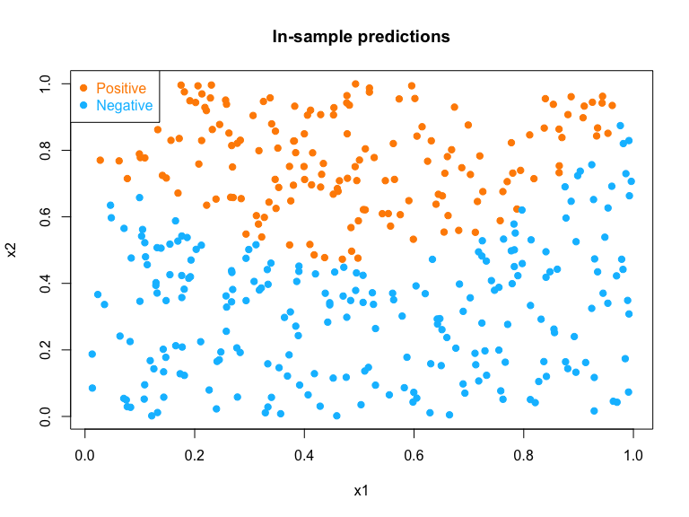

SVM
================
Rishabh Vaish

## Linearly Separable SVM using Quadratic Programming

Install the `quadprog` package (there are similar ones in Python too)
and utilize the function `solve.QP` to solve SVM (dual problem). The
`solve.QP` function is trying to perform the minimization problem:  For
more details, read the document file of the  package on CRAN.
Investigate the dual optimization problem of the seperable SVM
formulation, and write the problem into the above form by properly
defining \(\mathbf{D}\), \(d\), \(A\) and \(a\).

**Note**: The package requires \(\mathbf{D}\) to be positive definite,
while it may not be true in our problem. A workaround is to add a
“ridge,” e.g., \(10^{-5} \mathbf{I}\), to the \(\mathbf{D}\) matrix,
making it invertible. This may affect your later results, so figure out
a way to fix them.

You should generate the data using the following code (or write a
similar code in Python). After solving the quadratic programming
problem, perform the following:

  - Convert the solution into \(\beta\) and \(\beta_0\), which can be
    used to define the classification rule
  - Plot all data and the decision line
  - Add the two separation margin lines to the plot
  - Add the support vectors to the plot

<!-- end list -->

``` r
set.seed(1)
n <- 40
p <- 2
xpos <- matrix(rnorm(n * p, mean = 0, sd = 1), n, p)
xneg <- matrix(rnorm(n * p, mean = 4, sd = 1), n, p)
x <- rbind(xpos, xneg)
y <- matrix(c(rep(1, n), rep(-1, n)))

plot(
  x,
  col = ifelse(y > 0, "darkorange", "deepskyblue"),
  pch = 19,
  xlab = "x1",
  ylab = "x2"
)
legend(
  "topleft",
  c("Positive", "Negative"),
  col = c("darkorange", "deepskyblue"),
  pch = c(19, 19),
  text.col = c("darkorange", "deepskyblue")
)
```


``` r
#Implementing dual problem
Q <- sapply(1:nrow(x), function(i) y[i]*t(x)[,i])
D <- t(Q)%*%Q
I <- diag(10 ^ -5, nrow(x))
Dmat <- D + I
d <- matrix(1, nrow = nrow(x), ncol = 1)
A <- cbind(matrix(y, nrow=nrow(x), ncol=1), diag(nrow=nrow(x)))
b0 <- rbind( matrix(0, nrow=1, ncol=1) , matrix(0, nrow=nrow(x), ncol=1) )

#using quadprog
library(quadprog)
sol <- solve.QP(Dmat, dvec = d, Amat = A, b0, meq = 1)

#calculate beta = sum(alpha_i*y_i*x_i)
beta <- matrix(0, ncol = 2, nrow = 1)
for (i in 1:nrow(x)) {
  beta <- beta + sol$solution[i] * y[i] * x[i, ]
}
beta
```

    ##           [,1]      [,2]
    ## [1,] -0.933426 -0.384982

``` r
#calculating beta zero as given in class
beta_zero <-
  -(max(x[y == -1,] %*% t(beta)) + min(x[y == 1,] %*% t(beta))) / 2
beta_zero
```

    ## [1] 2.782373

``` r
b <- beta
b0 <- beta_zero

# plot on the data
plot(
  x,
  col = ifelse(y > 0, "red", "blue"),
  pch = 19,
  cex = 1.2,
  lwd = 2,
  xlab = "X1",
  ylab = "X2",
  cex.lab = 1.5,
  xlim = c(-4, 8),
  ylim = c(-3, 6),
)
legend(
  "bottomleft",
  c("Positive", "Negative"),
  col = c("red", "blue"),
  pch = c(19, 19),
  text.col = c("red", "blue"),
  cex = 1.5
)
#Decision Boundary
abline(
  a = -b0 / b[1, 2],
  b = -b[1, 1] / b[1, 2],
  col = "black",
  lty = 1,
  lwd = 2
)
# the two margin lines
abline(
  a = (-b0 - 1) / b[1, 2],
  b = -b[1, 1] / b[1, 2],
  col = "black",
  lty = 3,
  lwd = 2
)
abline(
  a = (-b0 + 1) / b[1, 2],
  b = -b[1, 1] / b[1, 2],
  col = "black",
  lty = 3,
  lwd = 2
)
#add support vectors
points(x[abs(sol$solution) > 5*10^-5, ], col="black", cex=3)
```


## Linearly Non-seperable SVM using Penalized Loss

We also introduced an alternative method to solve SVM. Consider a
logistic loss function

\[L(y, f(x)) = \log(1 + e^{- y f(x)})\] and solve the penalized loss for
a linear
SVM

\[ \underset{\beta_0, \beta}{\arg\min} \sum_{i=1}^n L(y_i, \beta_0 + x^T \beta) + \lambda \lVert \beta \rVert^2\]
The rest of the job is to solve this optimization problem. To do this,
we will utilize a general-purpose optimization package/function. For
example, in `R`, you can use the `optim` function. Read the
documentation of this function (or equivalent ones in Python) and set up
the objective function properly to solve for the parameters. If you need
an example of how to use the `optim` function, read the corresponding
part in the example file provide on our course website
[here](https://teazrq.github.io/stat542/other/r-intro.html) (Section
10). You should generate the data using the following code (or write a
similar code in Python). Perform the following:

  - Write a function to define the objective function (penalized loss).
    The algorithm may run faster if you further define the gradient
    function.
  - Choose a reasonable \(\lambda\) value so that your optimization can
    run properly. In addition, I recommend using the `BFGS` method in
    the optimization.
  - After solving the optimization problem, plot all data and the
    decision line
  - If needed, modify your \(\lambda\) so that the model fits reasonably
    well (you do not have to optimize this tuning), and re-plot

<!-- end list -->

``` r
set.seed(1)
n = 100 # number of data points for each class
p = 2 # dimension

# Generate the positive and negative examples
xpos <- matrix(rnorm(n * p, mean = 0, sd = 1), n, p)
xneg <- matrix(rnorm(n * p, mean = 1.5, sd = 1), n, p)
x <- rbind(xpos, xneg)
y <- c(rep(-1, n), rep(1, n))

plot(
  x,
  col = ifelse(y > 0, "darkorange", "deepskyblue"),
  pch = 19,
  xlab = "x1",
  ylab = "x2"
)
legend(
  "topleft",
  c("Positive", "Negative"),
  col = c("darkorange", "deepskyblue"),
  pch = c(19, 19),
  text.col = c("darkorange", "deepskyblue")
)
```


``` r
#create a loss function
loss <- function(x, y, beta, lambda)
{
  sum = 0
  power <- x %*% beta
  for (i in 1:length(y)) {
    sum = sum + log(1 + exp(-y[i] * (power[i])))
  }
  beta_norm <- sqrt(sum(beta ^ 2))
  return(sum + lambda * beta_norm)
}

#using optim function to optimize with lambda = 0.5
solution = optim(
  matrix(rep(0, 3)),
  loss,
  x = cbind(1, x),
  y = y,
  lambda = 0.5,
  method = "BFGS"
)
solution$par
```

    ##           [,1]
    ## [1,] -2.298452
    ## [2,]  1.524495
    ## [3,]  1.474166

``` r
#plot the results
plot(
  x,
  col = ifelse(y > 0, "red", "blue"),
  pch = 19,
  cex = 1.2,
  lwd = 2,
  xlab = "X1",
  ylab = "X2",
  cex.lab = 1.5
)
legend(
  "topright",
  c("Positive", "Negative"),
  col = c("red", "blue"),
  pch = c(19, 19),
  text.col = c("red", "blue"),
  cex = 1.5
)

b <- matrix(solution$par[2:length(solution$par)], ncol = 2)
b0 <- solution$par[1]
#decision boundary
abline(
  a = -b0 / b[1, 2],
  b = -b[1, 1] / b[1, 2],
  col = "black",
  lty = 1,
  lwd = 2
)
#plotting the margin 
abline(
  a = (-b0 - 1) / b[1, 2],
  b = -b[1, 1] / b[1, 2],
  col = "black",
  lty = 3,
  lwd = 2
)
abline(
  a = (-b0 + 1) / b[1, 2],
  b = -b[1, 1] / b[1, 2],
  col = "black",
  lty = 3,
  lwd = 2
)
```


## Nonlinear and Non-seperable SVM using Penalized Loss

We can further use the kernel trick to solve for a nonlinear decision
rule. The optimization becomes

\[\sum_{i=1}^n L(y_i, K_i^T \beta) + \lambda \beta^T K \beta\] where
\(K_i\) is the \(i\)th column of the \(n \times n\) kernel matrix \(K\).
For this problem, we consider the Gaussian kernel (you do not need an
intercept). Again, we can use the logistic loss.

You should generate the data using the following code (or write a
similar code in Python). Perform the following:

  - Pre-calculate the \(n \times n\) kernel matrix \(K\) of the observed
    data
  - Write a function to define the objective function (this should not
    involve the original \(x\), but uses \(K\)).
  - Choose a reasonable \(\lambda\) value so that your optimization can
    run properly
  - After solving the optimization problem, plot **fitted** labels
    (in-sample prediction) for all subjects
  - If needed, modify your \(\lambda\) so that the model fits reasonably
    well (you do not have to optimize this tuning), and re-plot
  - Summarize your in-sample classification error

<!-- end list -->

``` r
set.seed(1)
n = 400
p = 2 # dimension

# Generate the positive and negative examples
x <- matrix(runif(n * p), n, p)
side <- (x[, 2] > 0.5 + 0.3 * sin(3 * pi * x[, 1]))
y <-
  sample(c(1,-1), n, TRUE, c(0.9, 0.1)) * (side == 1) + sample(c(1,-1), n, TRUE, c(0.1, 0.9)) *
  (side == 0)

plot(
  x,
  col = ifelse(y > 0, "darkorange", "deepskyblue"),
  pch = 19,
  xlab = "x1",
  ylab = "x2"
)
legend(
  "topleft",
  c("Positive", "Negative"),
  col = c("darkorange", "deepskyblue"),
  pch = c(19, 19),
  text.col = c("darkorange", "deepskyblue")
)
```


``` r
#define a kernel function, assuming sigma = 1
kernel <- function(xi,xj){
  return(exp((-1/2)*sum((xi-xj)^2)))
}

#calculating n*n matrix of K
K <- matrix(0, nrow(x), nrow(x))
for (i in 1:nrow(x)){
  for (j in 1:nrow(x)){
    K[i,j] = kernel(x[i,],x[j,])
  }
}

#defining the loss function
kernel_loss <- function(k, y, beta, lambda)
{
  sum = 0
  for (i in 1:length(y)) {
    sum = sum + log(1 + exp(-y[i] * (t(k[,i])%*%beta)))
  }
  beta_norm <- t(beta)%*%k%*%beta
  return(sum + lambda * beta_norm)
}

#optimising using 
solution = optim(
  matrix(rep(0, nrow(x))),
  kernel_loss,
  k = K,
  y = y,
  lambda = 0.01,
  method = "BFGS"
)

#in sample prediction
pred <- ifelse( t(K)%*%solution$par >= 0 , 1, -1)
pred <- as.factor(pred)
y <- as.factor(y)

#plotting in-sample prediction
plot(
  x,
  col = ifelse(pred == 1, "darkorange", "deepskyblue"),
  pch = 19,
  xlab = "x1",
  ylab = "x2",
  main = "In-sample predictions"
)
legend(
  "topleft",
  c("Positive", "Negative"),
  col = c("darkorange", "deepskyblue"),
  pch = c(19, 19),
  text.col = c("darkorange", "deepskyblue")
)

#checking results
library(caret)
```



``` r
confusionMatrix(pred, y)
```

    ## Confusion Matrix and Statistics
    ## 
    ##           Reference
    ## Prediction  -1   1
    ##         -1 185  46
    ##         1   37 132
    ##                                           
    ##                Accuracy : 0.7925          
    ##                  95% CI : (0.7494, 0.8312)
    ##     No Information Rate : 0.555           
    ##     P-Value [Acc > NIR] : <2e-16          
    ##                                           
    ##                   Kappa : 0.5778          
    ##                                           
    ##  Mcnemar's Test P-Value : 0.3799          
    ##                                           
    ##             Sensitivity : 0.8333          
    ##             Specificity : 0.7416          
    ##          Pos Pred Value : 0.8009          
    ##          Neg Pred Value : 0.7811          
    ##              Prevalence : 0.5550          
    ##          Detection Rate : 0.4625          
    ##    Detection Prevalence : 0.5775          
    ##       Balanced Accuracy : 0.7875          
    ##                                           
    ##        'Positive' Class : -1              
    ##
