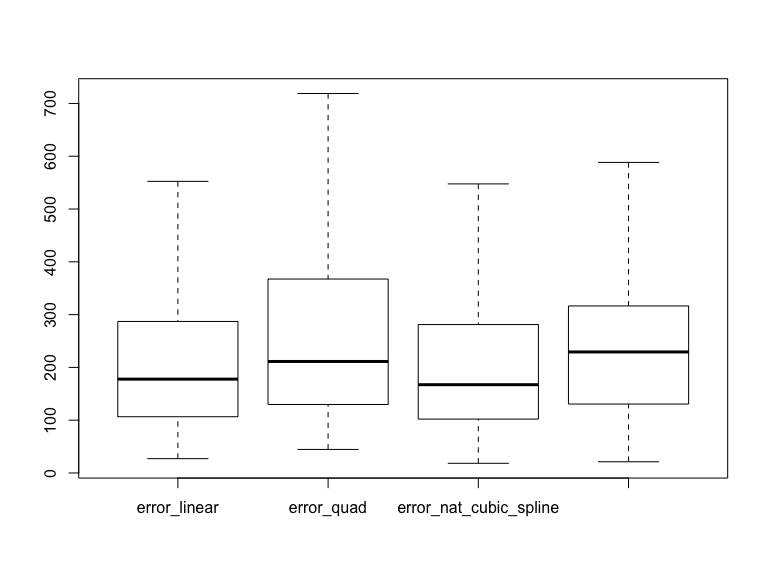

Splines
================
Rishabh Vaish

## A Simulation using Splines

We will perform a simulation study to compare the performance of several
different spline methods. Consider the following settings:

  - Training data \(n=30\): Generate \(x\) from \([-1, 1]\) uniformly,
    and then generate \(y = \sin(\pi x) + \epsilon\), where
    \(\epsilon\)’s are iid standard normal

<!-- end list -->

``` r
#data generation
n <- 30
x <- runif(n,-1, 1)
y <- sin(pi * x) + rnorm(n, 0, 1)
data_train <- data.frame(cbind(x, y))
```

  - Consider several different spline methods:
      - Write your own code (you cannot use `bs()` or similar functions)
        to implement a continuous piecewise linear spline fitting.
        Choose knots at \((-0.5, 0, 0.5)\)

<!-- end list -->

``` r
#continuous piecewise linear spline function which 
#returns the spline matrix that can be used for linear fitting
my_linear_spline <- function(x, knots) {
  #initialise spline matrix
  n = length(knots)
  spline_mat <- matrix(0, nrow = length(x), ncol = n + 1)
  spline_mat[, 1] <- x
  #creating spline matrix
  for (i in 1:length(x)) {
    if (x[i] > knots[1]) {
      spline_mat[i, 2] <- x[i] - knots[1]
    }
    if (x[i] > knots[2]) {
      spline_mat[i, 3] <- x[i] - knots[2]
    }
    if (x[i] > knots[3]) {
      spline_mat[i, 4] <- x[i] - knots[3]
    }
  }
  data <- data.frame(cbind(spline_mat, y))
  return(data)
}

#fitting the linear
knots <- c(-0.5, 0, 0.5)
linear_spline_data <- my_linear_spline(x, knots)
linear_spline <- lm(y ~ . , data = linear_spline_data)
```

  - Use existing functions to implement a quadratic spline 2 knots.
    Choose your own knots.

<!-- end list -->

``` r
#using spline library for quadratic spline
library(splines)
knots <- c(-0.5, 0.5)
quad_spline <-
  lm(y ~ bs(x, knots = knots, degree = 2), data = data_train)
```

  - Use existing functions to implement a natural cubic spline with 3
    knots. Choose your own knots.

<!-- end list -->

``` r
#Fitting the natural cubic spline using ns library
knots <- c(-0.5, 0, 0.5)
nat_cubic_spline <-
  lm(y ~ ns(x, knots = knots), data = data_train)   
```

  - Use existing functions to implement a smoothing spline. Use the
    built-in ordinary leave-one-out cross-validation to select the best
    tuning parameter.

<!-- end list -->

``` r
#Fitting the smooth spline using splines library
library(splines)
smooth_spline <- smooth.spline(x, y, cv = TRUE)
```

  - After fitting these models, evaluate their performances by comparing
    the fitted functions with the true function value on an equispaced
    grid of 1000 points on \([-1, 1]\). Use the squared distance as the
    metric.

<!-- end list -->

``` r
#generating test data
x_test <- seq(from = -1,
              to = 1,
              length.out = 1000)
y_test <- sin(pi * x_test)
data_test <- data.frame(cbind("x" = x_test, "y" = y_test))

#Prediction using linear spline
linear_spline_data <- my_linear_spline(x_test, knots)
y_hat_linear <- predict(linear_spline, newdata = linear_spline_data)

#Prediction using quadratic spline
y_hat_quad <- predict(quad_spline, newdata = data_test)

#Prediction using NCS
y_hat_nat_cubic_spline <-
  predict(nat_cubic_spline, newdata = data_test)

#Prediction using smooth spline
y_hat_smooth_spline <- predict(smooth_spline, x_test)$y

#Computing squared error for each
error_linear <- sum((y_test - y_hat_linear) ^ 2)
error_quad <- sum((y_test - y_hat_quad) ^ 2)
error_nat_cubic_spline <- sum((y_test - y_hat_nat_cubic_spline) ^ 2)
error_smooth_spline <- sum((y_test - y_hat_smooth_spline) ^ 2)

#Results
error_linear
```

    ## [1] 50.64301

``` r
error_quad
```

    ## [1] 176.4644

``` r
error_nat_cubic_spline
```

    ## [1] 33.45389

``` r
error_smooth_spline
```

    ## [1] 8.977282

  - Repeat the entire process 200 times. Record and report the mean,
    median, and standard deviation of the errors for each method.

<!-- end list -->

``` r
#Making error vectors for 200 iterations
error_linear <- rep(0, 200)
error_quad <- rep(0, 200)
error_nat_cubic_spline <- rep(0, 200)
error_smooth_spline <- rep(0, 200)

#generate test data
x_test <- seq(from = -1,
              to = 1,
              length.out = 1000)
y_test <- sin(pi * x_test)
data_test <- data.frame(cbind("x" = x_test, "y" = y_test))

#Running 200 options
for (i in 1:200) {
  #data generation
  n <- 30
  x <- runif(n,-1, 1)
  y <- sin(pi * x) + rnorm(n, 0, 1)
  data_train <- data.frame(cbind(x, y))
  
  #linear spline
  knots <- c(-0.5, 0, 0.5)
  linear_spline_data <- my_linear_spline(x, knots)
  linear_spline <- lm(y ~ . , data = linear_spline_data)
  
  #quad spline
  knots <- c(-0.5, 0.5)
  quad_spline <-
    lm(y ~ bs(x, knots = knots, degree = 2), data = data_train)
  
  #natural cubic spline
  knots <- c(-0.5, 0, 0.5)
  nat_cubic_spline <-
    lm(y ~ ns(x, knots = knots), data = data_train)
  
  #Smooth spline
  smooth_spline <- smooth.spline(x, y, cv = TRUE)
  
  #predictions
  linear_spline_data <- my_linear_spline(x_test, knots)
  y_hat_linear <-
    predict(linear_spline, newdata = linear_spline_data)
  y_hat_quad <- predict(quad_spline, newdata = data_test)
  y_hat_nat_cubic_spline <-
    predict(nat_cubic_spline, newdata = data_test)
  y_hat_smooth_spline <- predict(smooth_spline, x_test)$y
  
  #Calculating error
  error_linear[i] <- sum((y_test - y_hat_linear) ^ 2)
  error_quad[i] <- sum((y_test - y_hat_quad) ^ 2)
  error_nat_cubic_spline[i] <-
    sum((y_test - y_hat_nat_cubic_spline) ^ 2)
  error_smooth_spline[i] <- sum((y_test - y_hat_smooth_spline) ^ 2)
  
}

# Mean error
mean_error <-
  c(
    mean(error_linear),
    mean(error_quad),
    mean(error_nat_cubic_spline),
    mean(error_smooth_spline)
  )
mean_error
```

    ## [1]  263.5366 1051.6501  236.6751  376.7244

``` r
#Median error
median_error <-
  c(
    median(error_linear),
    median(error_quad),
    median(error_nat_cubic_spline),
    median(error_smooth_spline)
  )
median_error
```

    ## [1] 177.7639 211.1982 167.2214 229.2614

``` r
#Standard deviation of error
sd_error <-
  c(
    sd(error_linear),
    sd(error_quad),
    sd(error_nat_cubic_spline),
    sd(error_smooth_spline)
  )
sd_error
```

    ## [1]  447.1659 6967.4537  318.8497  781.7767

``` r
#combining error data for boxplot
error_data <-
  as.matrix(cbind(
    error_linear,
    error_quad,
    error_nat_cubic_spline,
    error_smooth_spline
  ))

#boxplot with outliers removed for better view
boxplot(error_data, outline = FALSE)
```



The mean error is minimum for natural cubic spline. The standard
deviation of error is also minimum for natural cubic spline. Thus NCS is
more stable as compared to other models. Hence, I would prefer natural
cubic spline for this data.
